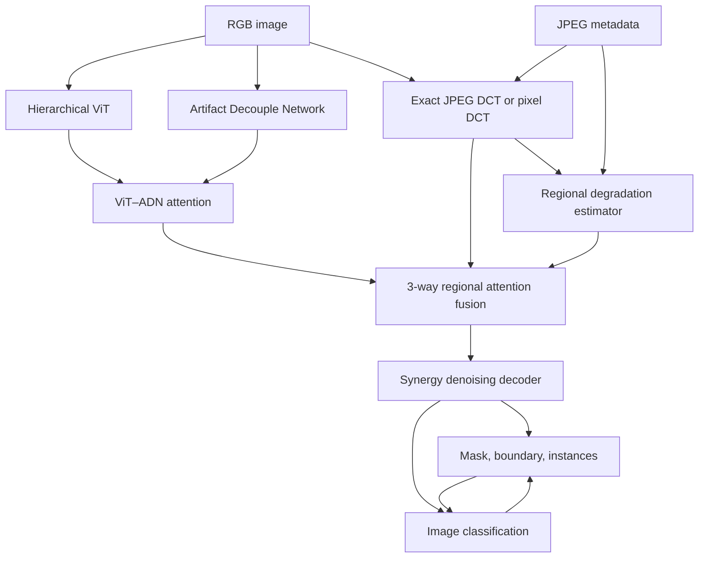

# DeepDocForgery

DeepDocForgery v0.3.0 is an end-to-end PyTorch research pipeline for document
forgery detection and localization. It accepts RGB content, DCT evidence, JPEG
metadata, and learned degradation maps; it produces:

- an image-level authentic/forged probability,
- a full-resolution tamper probability map,
- a boundary map and confidence map,
- connected-component instances and bounding boxes, and
- inspectable attention weights over spatial, frequency, and degradation evidence.

The code runs unchanged on Arch Linux under WSL and Ubuntu Desktop. The
included model is **untrained**: passing tests proves that the pipeline is
connected and trainable, not that it detects real forgeries accurately.

## Complete architecture



The two feedback arrows are trainable. Tentative localization pools suspicious
and background evidence into the image classifier; the final classifier then
conditions the mask. All fusion and synergy strengths receive gradients from
the joint objective.

DanceText describes this classification–localization idea but does not
currently publish DS-Net model source. The decoder here is a documented
clean-room, method-level implementation, not a copied reproduction.

## Installation

Use a repository-local environment on either platform:

```bash
python -m venv .venv
source .venv/bin/activate
python -m pip install --upgrade pip setuptools wheel
```

Install the PyTorch build for your hardware first. CPU example:

```bash
python -m pip install torch --index-url https://download.pytorch.org/whl/cpu
```

For NVIDIA CUDA, use the command generated by the official PyTorch selector
for your driver/runtime. Then install this project:

```bash
python -m pip install -e ".[dev,exact-jpeg,data]"
```

Native prerequisites for `jpegio`:

```bash
# Arch Linux / Arch WSL
sudo pacman -S --needed base-devel

# Ubuntu Desktop
sudo apt update
sudo apt install build-essential python3-dev python3-venv
```

## Verify the complete pipeline

```bash
python -m pytest -q
python -m ruff check .
python -m scripts.smoke_train --device cpu

# Only on a CUDA-enabled PyTorch installation
python -m scripts.smoke_train --device cuda
```

The smoke command performs real forward, backward, gradient clipping, and
optimizer updates. It verifies updates in the ViT, DCT branch, attention
fusion, and final decoder; it does not report detector accuracy.

## Immediate demo-data workflow

A 24-image synthetic dataset is included in `data/demo`. It has 12 source
documents, each paired with an authentic and forged version, and keeps every
pair in one split.

Regenerate it if desired:

```bash
python -m scripts.make_demo_dataset --output data/demo --force
```

Train the small end-to-end model:

```bash
python -m scripts.train \
  --config configs/train_demo.yaml \
  --device cpu \
  --output runs/demo
```

Resume without losing optimizer or scheduler state:

```bash
python -m scripts.train \
  --config configs/train_demo.yaml \
  --device cpu \
  --output runs/demo \
  --resume runs/demo/last.pt
```

Evaluate the test split:

```bash
python -m scripts.evaluate \
  --config configs/train_demo.yaml \
  --checkpoint runs/demo/best.pt \
  --split test \
  --device cpu \
  --output runs/demo/test-metrics.json
```

Run inference and save probability masks, binary masks, overlays, instances,
branch attention, and a JSON report:

```bash
python -m scripts.infer \
  --input data/demo/images \
  --checkpoint runs/demo/best.pt \
  --output runs/demo/predictions \
  --device cpu
```

For a native-resolution JPEG with exact coefficient extraction:

```bash
python -m scripts.infer \
  --input document.jpg \
  --checkpoint runs/demo/best.pt \
  --output runs/demo/exact-prediction \
  --exact-jpeg
```

## Real datasets

See [DATASETS.md](DATASETS.md) for:

- the authorized DocTamper application and Kaggle command,
- the corrected LMDB exporter,
- MIDV-DM and DanceText status,
- generic image/mask manifest construction,
- combining several datasets, and
- source-group split rules that prevent derivative leakage.

Use the research configuration after changing `data.manifest`:

```bash
python -m scripts.train \
  --config configs/train_research.yaml \
  --device cuda \
  --output runs/research
```

## Manifest contract

Each line is one JSON object:

```json
{
  "sample_id": "dataset:000001",
  "image": "images/000001.jpg",
  "mask": "masks/000001.png",
  "split": "train",
  "label": 1,
  "source_group": "original-document-0042",
  "dataset": "dataset-name",
  "tamper_type": "text_replacement"
}
```

The mask can be omitted for classification-only data. Such a sample is
excluded from mask losses; it is never silently treated as an all-authentic
pixel mask. Optional JPEG/noise fields provide degradation-estimator
supervision.

## Training objectives

The complete criterion reports every component separately:

- mask binary cross-entropy and soft Dice,
- image binary cross-entropy,
- boundary supervision,
- multi-scale auxiliary segmentation,
- evidence-confidence calibration,
- scale-denoising consistency,
- classification–localization agreement,
- JPEG quality, double compression, noise type, and noise strength,
- ADN artifact objectives, and
- exact/fallback DCT consistency.

The temporary fusion probe from v0.2.0 has been removed.

## Evaluation outputs

Evaluation reports fixed-threshold pixel precision, recall, F1, IoU and
accuracy; image precision, recall, F1, accuracy and AUROC; and
connected-component instance precision, recall and F1. Thresholds and minimum
instance area are configuration values and must be disclosed in experiments.

## Exact-DCT rule

Exact JPEG coefficients are valid only when coefficient blocks and decoded
pixels receive the same block-aligned geometry. Normal training letterboxes
images and therefore uses differentiable pixel DCT. Native JPEG inference may
use `--exact-jpeg`. Never resize RGB while claiming its original
coefficients are still spatially exact.

## Scientific boundary

Implemented and tested:

- complete model and losses,
- demo and real-data adapters,
- deterministic manifests and split validation,
- CPU/CUDA code paths,
- mixed precision on CUDA,
- atomic checkpoints and resume,
- validation, evaluation, inference and visual outputs.

Still requiring your experiments:

- authorized real datasets,
- meaningful training compute,
- checkpoint selection on validation only,
- external and cross-generator tests,
- robustness tests under JPEG/noise/resize,
- ablations and confidence intervals.

Synthetic/demo losses and metrics must never be presented as research results.

## Licence and attribution

Code is GPL-3.0-or-later. Dataset terms remain separate and may be more
restrictive. See [ATTRIBUTION.md](ATTRIBUTION.md) and [DATASETS.md](DATASETS.md).
