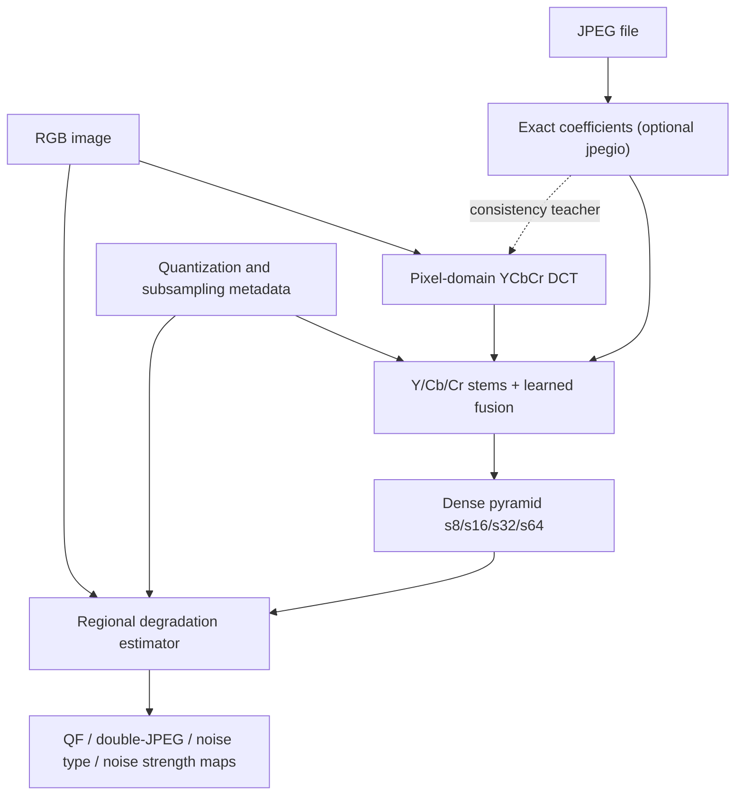

# DeepDocForgery — DCT and degradation-estimator milestone

This project implements the first two input branches of the proposed document
forgery pipeline while preserving the existing module names:

- `src/inputLayer/freqFeatures.py`
- `src/inputLayer/degradationEstimator.py`
- `src/inputLayer/dataModelling.py`

It is designed for CPU and NVIDIA CUDA execution. It is not a fork of one
reference repository: compatible ideas are integrated into a new interface and
credited in [ATTRIBUTION.md](ATTRIBUTION.md).

## Decisions implemented

1. **DCT output:** a learned multi-scale feature pyramid aligned with later
   fusion (`s8`, `s16`, `s32`, `s64` by default).
2. **Colour handling:** independent shallow Y, Cb, and Cr stems followed by
   learned fusion.
3. **JPEG/fallback policy:** exact JPEG coefficients are the primary input when
   available; a differentiable pixel-domain DCT is trained against them with a
   stop-gradient feature-consistency loss.
4. **Estimator input:** RGB + DCT pyramid + JPEG quantization/subsampling
   metadata.
5. **Estimator output:** configurable multi-scale *regional* maps only:
   JPEG quality (1–100), double-compression logits, noise-type logits, and noise
   strength on normalized RGB.

## Data flow



## Installation

Python 3.10 or 3.11 is the safest choice when exact `jpegio` extraction is
needed. Python 3.12 is suitable for the model code when compatible PyTorch and
`jpegio` wheels/build tools are available.

Create an environment and install the PyTorch build appropriate for your CPU or
CUDA version first. Then install this repository:

```bash
python -m venv .venv
source .venv/bin/activate
python -m pip install --upgrade pip
python -m pip install -e ".[dev]"
```

For exact JPEG coefficient extraction:

```bash
python -m pip install -e ".[dev,exact-jpeg]"
```

`jpegio` may compile from source, so Linux/WSL needs a working C/C++ build
toolchain (for Ubuntu, install the `build-essential` package first).

## Verify the milestone

```bash
pytest -q
python -m scripts.smoke_train --device cpu
python -m scripts.smoke_train --device cuda
```

The CUDA command should be run only in an environment where
`torch.cuda.is_available()` is true. The smoke generator is deliberately small
and only checks the forward pass, losses, gradients, and optimizer update.

## Minimal API

```python
import torch

from src.inputLayer.dataModelling import read_jpeg_metadata
from src.inputLayer.degradationEstimator import InputForensicsFrontEnd
from src.inputLayer.freqFeatures import ExactJPEGDCTReader

model = InputForensicsFrontEnd.from_config(
    {
        "dct": {
            "out_channels": [64, 128, 256, 384],
            "level_names": ["s8", "s16", "s32", "s64"],
        },
        "degradation_estimator": {},
    }
)

rgb = torch.rand(1, 3, 512, 512)
metadata = read_jpeg_metadata("document.jpg")
exact = ExactJPEGDCTReader().read("document.jpg")
output = model(rgb, metadata=metadata, exact_dct=exact)

dct_s8 = output.dct.features["s8"]
regional_qf_s8 = output.degradation.levels["s8"].jpeg_quality
gate_ready_s8 = output.degradation.gate_features()["s8"]
training_consistency = output.dct.consistency_loss
```

In real loading code, `rgb` must be the decoded pixels from the same JPEG and
must receive the same block-aligned crop as `exact`. Do not independently resize
the streams. For arbitrary resizing, omit `exact_dct` and use the pixel fallback.

## Target conventions

| Target | Tensor convention |
| --- | --- |
| JPEG quality | `[B,1,H,W]`, values 1–100 |
| Double compression | `[B,1,H,W]`, binary 0/1 |
| Noise type | `[B,H,W]`, integer class index |
| Noise strength | `[B,1,H,W]`, amplitude/std. dev. on RGB in `[0,1]` |
| JPEG/noise validity | Optional `[B,1,H,W]` masks |

Default noise classes are `none`, `gaussian`, `poisson`, and `speckle`; both the
names and number of classes are configurable. The loss resamples full-resolution
targets to every prediction scale and returns individual components plus a total.

## Important research boundaries

- The included synthetic degradation generator is a wiring test, not benchmark
  data and not realistic JPEG synthesis.
- Exact coefficients come from the optional `jpegio` backend. Pixel-domain DCT
  is the robust fallback for non-JPEG files and geometrically transformed data.
- The fallback honours declared 4:4:4, 4:2:2, or 4:2:0 chroma subsampling before
  DCT so its feature-consistency target is spatially compatible with exact JPEG
  component grids.
- Quantization tables describe the final JPEG encoding. They do not reveal the
  first quality factor of a double-compressed region; the network must infer that
  from image/frequency evidence.
- Real regional supervision should later be generated from controlled cut-paste,
  single/double JPEG, and noise operations with known parameter maps.
- No image-level classifier, spatial ViT/ADN branch, gate, fusion block, or
  denoising decoder is included yet.

## Licence

DeepDocForgery is released under GPL-3.0-or-later. Upstream notices and the
copy-vs-concept boundary are documented in [ATTRIBUTION.md](ATTRIBUTION.md).
