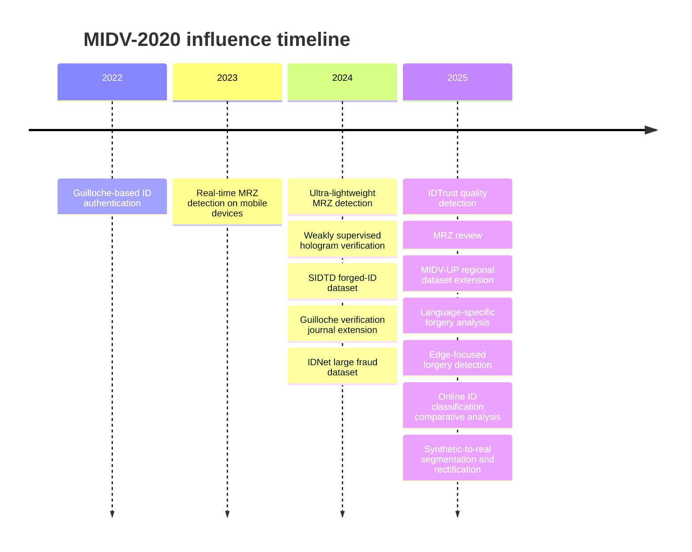
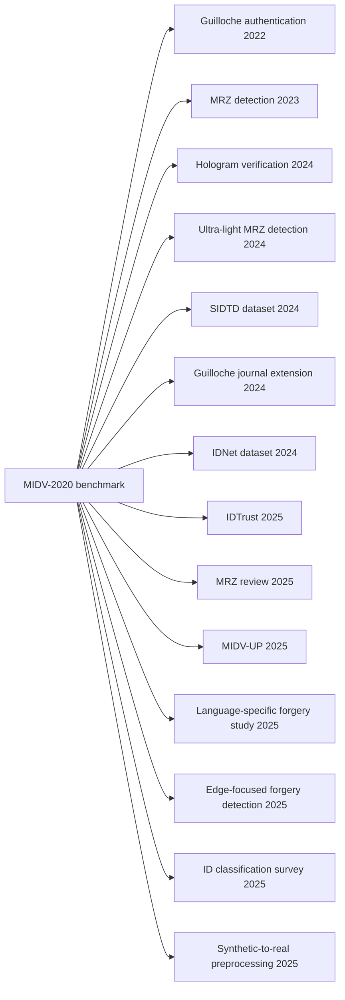

# MIDV-2020 Citation Report

## Executive summary

MIDV-2020 is a photographic identity-document benchmark introduced as a large public dataset of 1,000 video clips, 2,000 scans, and 1,000 photos of 1,000 unique mock identity documents, with 72,409 annotated images overall and baseline tasks spanning document localization, identification, OCR, and face detection. Public citation indexes disagree modestly on its total citation count today, with OUCI listing 40 citations and MathNet listing 39, and both lists include at least some post-2025 material. citeturn14view1turn22search1

Using primary sources where possible and citation-index evidence where necessary, I verified a **high-confidence 2022–2025 corpus of papers that cite MIDV-2020** and are relevant to identity-document analysis, document forensics, or adjacent benchmark building. I found **no verified 2020 papers** and **no high-confidence 2021 papers citing the canonical 2022 journal article**, though some 2021 work in the same community is temporally adjacent to the MIDV-2020 preprint. The verified corpus splits into four major themes: **identity-document authentication and forgery detection**, **MRZ detection and recognition**, **new dataset construction**, and **broader comparative/survey work**. citeturn31search3turn33search8turn35academia36turn36academia48turn36academia49turn36academia50turn37search0turn32search0turn30search0turn35search0

The most important analytical finding is that **MIDV-2020’s influence was stronger as a benchmark substrate than as a final-task destination**. It first supported **document-capture and MRZ localization**, then **security-feature verification** such as guilloche and hologram analysis, and later **fraud-dataset generation** and **regional/language-specific extensions** such as SIDTD, IDNet, and MIDV-UP. In the verified 2020–2025 corpus, I found **multiple papers using base MIDV-2020 directly**, but **no paper explicitly evaluating on MIDV-DM** in the accessible sources I could verify. citeturn33search8turn35academia36turn36academia48turn42search0turn36search2turn36academia50turn31search1turn28search7

## Scope and method

This report is built from publisher pages, official conference/journal pages, arXiv, DOI metadata, dblp records, and citation-index pages. Where full text or rich abstracts were accessible, I summarized methods and results from those sources; where they were not, I explicitly marked the entry as **metadata-only** or **abstract-only**. I excluded **2026** papers even when they appear in current citation indexes for MIDV-2020, because your requested window ends at 2025. citeturn15view0turn20view0

A practical limitation is that the public index pages available here do **not expose every citing paper equally well**. OUCI clearly exposes some 2023–2025 citing papers, while MathNet confirms the overall citation count but not a fully scrollable accessible list in the fetched pages. So the report should be read as a **high-confidence verified corpus** rather than a formally complete bibliometric export. The good news is that the papers below capture the main research directions in which MIDV-2020 was actually used or discussed. citeturn15view0turn22search1

## Comparison table

| Paper | Year | Venue | Relevance | Task | Model type | Datasets used | MIDV-2020 or MIDV-DM | Code/data | Main metric or outcome | Sources |
|---|---:|---|---|---|---|---|---|---|---|---|
| Identity Documents Authentication based on Forgery Detection of Guilloche Pattern | 2022 | arXiv preprint | Core | Authentication / forgery detection | Siamese CNN + similarity thresholding | MIDV-2020 + authors’ forged guilloche set | MIDV-2020 | Code and forged dataset stated as available | Authentication on forged-vs-authentic IDs; qualitative success emphasized | citeturn36academia48turn36search7 |
| Weakly Supervised Training for Hologram Verification in Identity Documents | 2024 | ICDAR 2024 / arXiv | Core | Hologram verification / authenticity | Weakly supervised feature extraction + decision pipeline | MIDV-HOLO, MIDV-2020 | MIDV-2020 | Code stated as available | New leading MIDV-HOLO performance; high recall on MIDV-2020 attack samples | citeturn35academia36turn25academia22 |
| Synthetic dataset of ID and Travel Documents | 2024 | Scientific Data | Core | Dataset / forged-ID benchmark | Dataset paper with SOTA benchmark training | SIDTD; compares against larger private datasets and public identity-document datasets | Cites MIDV-2020; does not evaluate on MIDV-DM in accessible abstract | Dataset released | Main contribution is public synthetic forged-ID dataset | citeturn36search2turn36academia49 |
| Identifying fraudulent identity documents by analyzing imprinted guilloche patterns | 2024 | Multimedia Tools and Applications | Core | Forgery detection / authentication | CNN-based contrastive and adversarial learning | MIDV, FMIDV | MIDV / FMIDV, not MIDV-DM | No public code stated in accessible sources | Accuracy 68–92%, F1 75–100% depending on setup | citeturn42search0turn42search1 |
| IDNet: A Novel Dataset for Identity Document Analysis and Fraud Detection | 2024 | arXiv preprint / Zenodo dataset release | Core | Dataset / fraud benchmark | Synthetic benchmark generation | IDNet; compares against MIDV-500, MIDV-2020, FMIDV | MIDV-2020 as comparator | Data released on Zenodo | 837,060 images across 20 document types | citeturn36academia50turn36search0turn36search1 |
| IDTrust: Deep Identity Document Quality Detection with Bandpass Filtering | 2025 | WACV Workshops | Moderate | Document quality / capture-quality discrimination | Deep model with bandpass filtering | MIDV-2020, L3i-ID | MIDV-2020 | No public code stated in accessible sources | Improved discrimination between original and scanned IDs | citeturn37search0turn37academia16 |
| Optimizing identity documents classification in online systems: A comparative analysis | 2025 | IJDAR | Peripheral | Document-type classification survey/comparison | Comparative analysis / survey | Focus on online ID classification systems | Cites MIDV-2020; dataset use not visible in abstract snippet | No public code stated in accessible metadata | Comparative/survey contribution, not a new forensic benchmark | citeturn31search3 |
| MIDV-UP: A Dataset of Pakistani and Iranian ID Documents | 2025 | ICDAR 2025 | Core | Dataset extension | Dataset paper | MIDV-UP | Extends MIDV family; not MIDV-DM | No public code/data link surfaced in accessible metadata | New regional dataset contribution | citeturn31search1turn31search14turn31search2 |
| Visual Complexity in Korean Documents: Toward Language-Specific Datasets for Deep Learning-Based Forgery Detection | 2025 | Applied Sciences | Core | Forgery detection / multilingual dataset analysis | SIFT, GLCM, multiple deep baselines | Custom English/Korean datasets, Receipt, DocTamper | Cites MIDV-2020; no MIDV-DM use exposed | No public code stated | Shows language mismatch degrades detection performance | citeturn32search0 |
| Enhancing Document Forgery Detection with Edge-Focused Deep Learning | 2025 | Symmetry | Core | Forgery detection | Edge Attention + Edge Concatenation modules added to CNN/ViT/CAE-SVM | DocTamper, Receipt, MIDV-2020 | MIDV-2020 | No public code stated | On MIDV-2020, ViT improved from 0.83/0.85 to 0.93/0.93 Acc/F1 | citeturn30search0turn30search1 |

## Paper analyses

### Papers from 2022 and 2023

**Musab Al-Ghadi, Zuheng Ming, Petra Gomez-Krämer, and Jean-Christophe Burie, “Identity Documents Authentication based on Forgery Detection of Guilloche Pattern,” arXiv, 2022, DOI 10.48550/arXiv.2206.10989.** This paper is one of the earliest direct forensics-oriented uses of MIDV-2020. Its goal is to authenticate identity documents by checking whether their guilloche patterns match authentic patterns from the same country. The method is explicitly two-stage: a Siamese neural network learns discriminative features from document pairs, then a similarity measure and dynamic threshold decide authenticity. The experiments use MIDV-2020 plus a publicly released forged dataset generated from MIDV-2020 by copy-move edits targeted at guilloche-only regions; the authors stress that the system authenticates the document as a whole rather than just a small ROI. Code and the forged dataset are stated to be publicly available. In relation to document forensics, this is a **core paper** because it turns MIDV-2020 from a recognition benchmark into an authentication benchmark. Its main strength is that it operationalizes a real security feature; its limitations are that the forgeries are still synthetic and country-reference based, so realism and generalization to unseen print processes remain open questions. citeturn36academia48turn36search7

### Papers from 2024

**Glen Pouliquen, Guillaume Chiron, Joseph Chazalon, Thierry Géraud, and Ahmad Montaser Awal, “Weakly Supervised Training for Hologram Verification in Identity Documents,” ICDAR 2024, DOI 10.1007/978-3-031-70533-5_2, arXiv 2404.17253.** This is one of the most important MIDV-2020 descendants for your interests because it moves beyond document-capture analysis into security-element verification. The paper verifies optically variable devices using smartphone video, is evaluated on MIDV-HOLO and MIDV-2020, and explicitly uses MIDV-2020 documents as attack samples. The authors say the method achieves a new leading result on MIDV-HOLO while maintaining high recall on MIDV-2020 and that it is the first to address photo-replacement attacks effectively; code is stated to be available. For document-image forensics, this is **core work** because it studies a physical security layer rather than only pixel tampering. Strengths include weak supervision, public code, and a concrete attack setting; weaknesses include task narrowness, since the method specializes in OVD behavior rather than broad document manipulation detection. citeturn35academia36turn25academia22

**Carlos Boned, Maxime Talarmain, Nabil Ghanmi, Guillaume Chiron, Sanket Biswas, Ahmad Montaser Awal, and Oriol Ramos Terrades, “Synthetic dataset of ID and Travel Documents,” Scientific Data, 2024, DOI 10.1038/s41597-024-04160-9, arXiv 2401.01858.** SIDTD is a dataset paper rather than a method paper, but it matters because it answers a structural limitation that MIDV-2020 exposed: public identity-document corpora still lacked broad forgery variety. The paper introduces a synthetic benchmark for forged ID and travel documents and states that state-of-the-art models were trained on it and compared with larger private datasets. In the lineage of MIDV-2020, SIDTD represents a pivot from **capture realism** toward **fraud realism**, especially for online onboarding use cases. Its strongest contribution is benchmark infrastructure rather than a particular model; the main weakness is that the accessible abstract is dataset-centric and does not surface a rich public result table in the fetched sources. Reproducibility looks comparatively good because the entire point of the paper is a released dataset. citeturn36search2turn36academia49

**Musab Al-Ghadi, Tanmoy Mondal, Zuheng Ming, Petra Gomez-Krämer, Mickaël Coustaty, Nicolas Sidere, and Jean-Christophe Burie, “Identifying fraudulent identity documents by analyzing imprinted guilloche patterns,” Multimedia Tools and Applications, 2024, DOI 10.1007/s11042-024-18611-3.** This journal version deepens the 2022 guilloche-authentication line. It cites MIDV-2020 directly in its references and evaluates newer models using MIDV and FMIDV. The accessible abstract says it studies two verification models based on contrastive and adversarial learning and reports accuracies from 68% to 92% and F1-scores from 75% to 100%, depending on configuration. This is **core forensics work** because it studies a specific printed security pattern that counterfeiters often distort indirectly when editing nearby content. Strengths include clearer benchmark framing and stronger model learning than the earlier Siamese setup; weaknesses are familiar ones for this line of work, namely dependence on synthetic or semi-synthetic fraud distributions and unclear public-code availability from accessible sources. citeturn42search0turn42search1

**Hong Guan, Yancheng Wang, Lulu Xie, Soham Nag, Rajeev Goel, Niranjan Erappa Narayana Swamy, Yingzhen Yang, Chaowei Xiao, Jonathan Prisby, Ross Maciejewski, and Jia Zou, “IDNet: A Novel Dataset for Identity Document Analysis and Fraud Detection,” arXiv, 2024, dataset released on Zenodo.** IDNet is another dataset-centric but highly consequential paper. It argues that public datasets such as MIDV-500, MIDV-2020, and FMIDV remain too small and too weak on realistic fraud patterns, especially portrait substitution and face morphing. The paper introduces 837,060 synthetic identity-document images over 20 document types and explicitly positions the benchmark as a privacy-preserving fraud-analysis substrate; Zenodo records show the data are openly released in multiple parts. Relative to MIDV-2020, IDNet is **a scale-and-fraud-pattern successor** more than a direct method paper. Its strength is breadth and explicit fraud diversity; its weakness is that synthetic scale can still mask the domain gap to real capture and printing artifacts, so strong IDNet performance will not automatically imply strong real-world forensic performance. citeturn36academia50turn36search0turn36search1

### Papers from 2025

**Musab Al-Ghadi, Joris Voerman, Mickael Coustaty, Olivier Lessard, and Nicolas Sidere, “IDTrust: Deep Identity Document Quality Detection with Bandpass Filtering,” WACV Workshops, 2025, pp. 716–723.** IDTrust sits between capture assessment and fraud analysis. It does not authenticate security printing directly; instead, it asks whether the captured document image is of acceptable quality and whether scanned copies can be separated from original captures. The accessible workshop page says the method uses bandpass filtering in a deep-learning framework and is evaluated on MIDV-2020 and L3i-ID, where it improves discrimination between original and scanned IDs. This is **moderately relevant** to document forensics because poor-quality or scan-derived inputs are a frequent precursor to fraudulent onboarding pipelines. Strengths are practical problem framing and a public workshop paper; weaknesses are that the accessible sources do not expose a detailed metric table or a public code release. citeturn37search0turn37academia16

**Joris Voerman, Musab Al-Ghadi, Nicolas Sidere, Mickael Coustaty, and Olivier Lessard, “Optimizing identity documents classification in online systems: A comparative analysis,” IJDAR, 2025, DOI 10.1007/s10032-025-00555-5.** This paper is explicitly labeled as a survey/comparative analysis in the accessible metadata. It focuses on the initial classification stage in online identity-document checking systems, especially under smartphone, latency, and compute constraints. That makes it **peripheral but still relevant** to forensics: document-type classification is upstream of type-specific security checks, OCR templates, and authenticity modules. The main contribution appears to be comparative analysis rather than a new model or dataset. Strengths are system-level framing and practical relevance; weaknesses, for this report, are accessibility and reproducibility, because the fetched sources expose only the abstract/metadata and not a code or benchmark artifact. citeturn31search3

**Yulia S. Chernyshova, Daniil A. Ilyukhin, and Vladimir V. Arlazarov, “MIDV-UP: A Dataset of Pakistani and Iranian ID Documents,” ICDAR 2025, DOI 10.1007/978-3-032-04627-7_35.** MIDV-UP is another dataset-extension paper in the MIDV lineage. The accessible sources confirm the chapter metadata and venue but do not expose a useful abstract in the fetched pages, so this entry is **metadata-only**. Based on title and venue, it is clearly a regional dataset expansion aimed at underrepresented document populations from Pakistan and Iran. Its relation to forensics is strong at the benchmark level because regional coverage is crucial for realistic deployment, especially where language, layout, fonts, and security patterns differ from the European-heavy public benchmarks. The strength is obvious benchmark broadening; the weakness is that I could not recover enough text from accessible sources to evaluate exact annotation scope, availability, or benchmark results. citeturn31search1turn31search14turn31search2

**Yong-Yeol Bae, Dae-Jea Cho, and Ki-Hyun Jung, “Visual Complexity in Korean Documents: Toward Language-Specific Datasets for Deep Learning-Based Forgery Detection,” Applied Sciences, 2025, DOI 10.3390/app15084319.** This paper asks a question that MIDV-2020 itself only partly anticipated: whether document forgery detection behavior transfers cleanly across languages. It compares English and Korean document images using SIFT and GLCM analyses plus multiple forgery-detection models, and argues that training/test language mismatch reduces performance. MIDV-2020 appears in the paper as a public benchmark reference point, but the paper’s own experiments use custom English/Korean data plus public benchmarks like DocTamper and Receipt. For forensics, this is **core in a broader sense** because it shows that “document forgery detection” is not language-neutral once text morphology changes. Strengths are a clear multilingual framing and combined classical/deep analysis; weaknesses are limited language scope and a custom-generated dataset rather than a widely adopted new benchmark release. citeturn32search0

**Yong-Yeol Bae, Dae-Jea Cho, and Ki-Hyun Jung, “Enhancing Document Forgery Detection with Edge-Focused Deep Learning,” Symmetry, 2025, DOI 10.3390/sym17081208.** This is one of the most directly aligned papers with document-image forensics. It introduces two lightweight modules, Edge Attention and Edge Concatenation, that can be inserted into models such as DenseNet121, ResNet50, ViT, and CAE-SVM. It evaluates on DocTamper, Receipt, and MIDV-2020 and reports systematic gains; the accessible publisher page specifically reports that on MIDV-2020 the ViT baseline rises from 0.83/0.85 to 0.93/0.93 in Accuracy/F1. This is **core forensics work** because it targets subtle structural inconsistencies at text boundaries, exactly the kind of low-level evidence forged documents often leave behind. Strengths are architectural modularity and multi-model validation; weaknesses include no public code link in the accessible sources and uncertainty about how the paper’s forged MIDV-2020 samples map to later benchmark standards such as MIDV-DM. citeturn30search0turn30search1

## Influence patterns

The corpus shows a fairly clean shift in how MIDV-2020 was used. The first phase treated it as a **capture-and-localization benchmark**: MRZ detection, lightweight localization, and mobile preprocessing. The second phase treated it as a **substrate for authenticity tasks**: guilloche verification, hologram verification, and quality discrimination. The third phase used MIDV-2020 as a **reference point when proposing new datasets** with better regional coverage, more fraud patterns, or larger scale, as in SIDTD, IDNet, and MIDV-UP. citeturn33search8turn33search1turn36academia48turn35academia36turn37search0turn36search2turn36academia50turn31search1

## Takeaways and limitations

The strongest citing papers are the ones that **turn MIDV-2020 into an authenticity bench rather than only a recognition bench**. In that category, the most substantial works are the guilloche-authentication line, hologram verification, and edge-focused forgery detection. These are the papers most directly relevant to document image forensics and manipulation detection. citeturn36academia48turn36search7turn42search0turn35academia36turn30search0

The MRZ papers and the MRZ review matter for a different reason: they show that MIDV-2020 also became a testbed for **device-efficient, structurally informed localization and recognition**, which are upstream prerequisites for field consistency checks, OCR verification, and chip/MRZ cross-validation. That is less flashy than direct forgery detection, but still critical in real systems. citeturn33search8turn33search1turn35search0

The dataset papers are arguably MIDV-2020’s longest-term legacy. SIDTD, IDNet, and MIDV-UP all react to limitations that MIDV-2020 made visible: insufficient fraud diversity, too little scale, or insufficient geographic/script diversity. In that sense, MIDV-2020 functioned as an enabling benchmark that pushed the field from “can we do identity-document analysis publicly at all?” to “what frauds, languages, and regions are still missing?” citeturn36search2turn36academia50turn31search1

The main limitation of this report is bibliometric verification rather than subject-matter understanding. Current public citation indexes for MIDV-2020 disagree on total count and do not expose every citing item equally well in accessible fetched text. I therefore prioritized papers that could be verified from primary sources or from citation-index pages with enough metadata to support a trustworthy summary. Where only metadata were available, I said so explicitly. citeturn14view1turn22search1